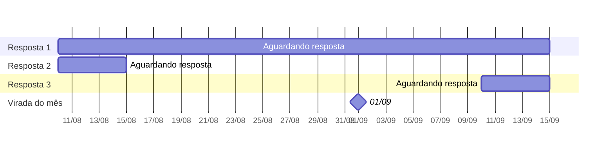

<Callout kind="info" collapsed="false">
  **Em resumo:** o card de **Métricas de Pesquisas** conta pela data em que o **convite saiu**. O card de **Métricas de Perguntas** conta pela data em que a **resposta chegou**. Quando o cliente responde num período diferente do convite, cada card mostra essa resposta num período diferente.
</Callout>

## A pergunta que cada card responde

O card de Métricas de Pesquisas mostra **Convites Respondidos** e o card de Métricas de Perguntas mostra **Respostas Recebidas nesta Pergunta**. Parecem a mesma coisa, mas cada um responde uma pergunta diferente:

<Columns cols="2">
  <Card title="Métricas de Pesquisas" icon="lucide-clipboard-list" horizontal="false">
    **"Dos convites que saíram neste período, quantos foram respondidos?"**

    Filtra pela **data do convite**. A resposta entra no período do convite, mesmo que tenha chegado depois.
  </Card>

  <Card title="Métricas de Perguntas" icon="lucide-message-circle-question" horizontal="false">
    **"Quantas respostas chegaram neste período?"**

    Filtra pela **data da resposta**. A resposta entra no período em que chegou, mesmo que o convite tenha saído antes.
  </Card>
</Columns>

---

## Pense em boletos

A lógica é a mesma de um controle de boletos:

- **Relatório de boletos emitidos em agosto:** 100 boletos emitidos, 90 já pagos. Um boleto emitido em 30/08 e pago em 05/09 conta aqui, em agosto.
- **Relatório de pagamentos recebidos em agosto:** 95 pagamentos. Entram boletos emitidos em julho e pagos em agosto.

Ninguém espera que "boletos pagos" de um relatório seja igual a "pagamentos recebidos" do outro. Os dois estão certos, só olham para datas diferentes.

No painel, o **convite** é o boleto emitido e a **resposta** é o pagamento. O card de Métricas de Pesquisas é o relatório de emitidos e o card de Métricas de Perguntas é o relatório de pagamentos recebidos.

---

## Exemplo passo a passo

Considere três respostas de uma mesma pesquisa:

| Resposta   | Data do convite | Data da resposta |
| ---------- | --------------- | ---------------- |
| Resposta 1 | 10/08           | 15/09            |
| Resposta 2 | 10/08           | 15/08            |
| Resposta 3 | 10/09           | 15/09            |

Na linha do tempo, cada barra começa no convite e termina na resposta. A Resposta 1 é a única que atravessa a virada do mês:

O card de Métricas de Pesquisas olha para **onde a barra começa**. O card de Métricas de Perguntas olha para **onde a barra termina**.

### Painel filtrado em agosto

| Card                      | O que aparece                                                              | Quais respostas entram                                      |
| ------------------------- | -------------------------------------------------------------------------- | ----------------------------------------------------------- |
| **Métricas de Pesquisas** | Convites: 2 · Convites Respondidos: 2 · Taxa de Resposta por Convite: 100%  | Respostas 1 e 2 — os dois convites saíram em agosto         |
| **Métricas de Perguntas** | Respostas Recebidas nesta Pergunta: 1                                                     | Resposta 2 — a única que chegou em agosto                   |

### Painel filtrado em setembro

| Card                      | O que aparece                                                              | Quais respostas entram                                  |
| ------------------------- | -------------------------------------------------------------------------- | ------------------------------------------------------- |
| **Métricas de Pesquisas** | Convites: 1 · Convites Respondidos: 1 · Taxa de Resposta por Convite: 100%  | Resposta 3 — o único convite que saiu em setembro       |
| **Métricas de Perguntas** | Respostas Recebidas nesta Pergunta: 2                                                     | Respostas 1 e 3 — as duas chegaram em setembro          |

Somando agosto e setembro, os dois cards chegam a **3 respostas**. Nenhuma se perde e nenhuma é contada duas vezes. A Resposta 1 só muda de mês conforme o card.

---

## O caso mais comum: envio no fim do mês

Um cliente recebe o convite por e-mail em **28/08**, recebe o lembrete em **02/09** e responde em **03/09**.

| Card                      | Em qual mês a resposta aparece | Por quê                                          |
| ------------------------- | ------------------------------ | ------------------------------------------------ |
| **Métricas de Pesquisas** | Agosto                         | O convite saiu em 28/08                          |
| **Métricas de Perguntas** | Setembro                       | A resposta chegou em 03/09                       |

O lembrete não cria um convite novo: a resposta continua ligada ao convite de 28/08.

---

## O mês que já passou continua mudando no card de Métricas de Pesquisas

Como o card de Métricas de Pesquisas coloca a resposta no mês do convite, uma resposta atrasada aumenta os números de um mês que já acabou. Por exemplo, olhando sempre para o mês de agosto:

| Dia em que você abre o painel | Métricas de Pesquisas — agosto        | Métricas de Perguntas — agosto |
| ----------------------------- | ------------------------------------- | ------------------------------ |
| 01/09                         | 100 convites · 40 convites respondidos · 40%     | 45 respostas                   |
| 15/09                         | 100 convites · 55 convites respondidos · 55%     | 45 respostas                   |

Entre 01/09 e 15/09 chegaram mais 15 respostas de convites enviados em agosto. Elas sobem o agosto do card de Métricas de Pesquisas e entram no **setembro** do card de Métricas de Perguntas, que não muda o agosto.

<Callout kind="tip" collapsed="false">
  Por isso o período mais recente costuma mostrar uma taxa de resposta mais baixa no card de Métricas de Pesquisas: parte dos convites ainda está dentro do prazo e pode ser respondida nos próximos dias.
</Callout>

---

## Quando a diferença é maior e quando quase some

| Situação                                          | Diferença entre os cards | Por quê                                                                                   |
| ------------------------------------------------- | ------------------------ | ----------------------------------------------------------------------------------------- |
| Convites por e-mail, SMS ou WhatsApp              | Maior                    | O convite conta quando é enviado, e o cliente pode responder dias depois                  |
| Link, QR Code e In-App                            | Pequena                  | O convite só conta quando a pessoa abre a pesquisa, normalmente no mesmo momento em que responde |
| Períodos curtos (hoje, esta semana, este mês)     | Maior                    | Mais convites e respostas ficam de lados diferentes da data de corte                      |
| Períodos longos (últimos 6 ou 12 meses)           | Pequena                  | Convite e resposta tendem a cair dentro do mesmo período                                  |

---

## Outros motivos para os números não baterem

Além da data, confira três pontos:

- **Pergunta não respondida.** O card de Métricas de Perguntas conta só as respostas **daquela pergunta**. Se o cliente pulou a pergunta, ou se ela não foi exibida para ele, a resposta entra no card de Métricas de Pesquisas e não entra no card de Métricas de Perguntas.
- **Pesquisas diferentes.** Cada card tem a sua própria seleção de pesquisas. Um card de Métricas de Perguntas pode somar perguntas de várias pesquisas. Compare apenas cards que olham para as mesmas pesquisas.
- **Filtros do card.** Cada card pode ter filtros próprios. Se só um dos dois estiver filtrado, os números vão ser diferentes mesmo com a mesma data.

---

## Qual card usar para cada pergunta

| Se você quer saber...                                          | Use o card               |
| -------------------------------------------------------------- | ------------------------ |
| Qual foi a nota (NPS, CSAT, CES) no período                    | Métricas de Perguntas    |
| Quantas respostas chegaram no período                          | Métricas de Perguntas    |
| Quantos convites saíram no período                             | Métricas de Pesquisas    |
| Quantos dos convites enviados foram respondidos                | Métricas de Pesquisas    |
| Qual a taxa de resposta dos envios do período                  | Métricas de Pesquisas    |

---

## Perguntas frequentes

<ExpandableGroup>
  <Expandable title="Qual dos dois números está certo?" default-open="false">
    Os dois. Cada card responde uma pergunta diferente: o de Métricas de Pesquisas responde "dos convites deste período, quantos foram respondidos?" e o de Métricas de Perguntas responde "quantas respostas chegaram neste período?".
  </Expandable>

  <Expandable title="Por que o número de um mês já fechado mudou?" default-open="false">
    Se foi no card de Métricas de Pesquisas, é porque um convite enviado naquele mês foi respondido depois. A resposta conta no mês do convite, então as respostas e a taxa daquele mês sobem conforme as respostas atrasadas chegam.
  </Expandable>

  <Expandable title="Posso somar ou subtrair os números dos dois cards?" default-open="false">
    Não. Como cada card usa uma data diferente, a diferença entre eles não representa um grupo de respostas específico. Para comparar, use o card certo para cada pergunta, conforme a tabela acima.
  </Expandable>

  <Expandable title="Na minha conta os números batem. Por quê?" default-open="false">
    Verifique a opção **Cards Compactos** em **Configurações → Painéis**. Com ela desligada, os cards seguem o modelo antigo de cálculo e esta página não se aplica. Veja o artigo sobre a mudança nas métricas do painel.
  </Expandable>
</ExpandableGroup>

---

## Leia também

<Columns cols="2">
  <Card title="O que significam as métricas do painel?" href="/o-que-significam-as-mtricas-do-painel" icon="lucide-bar-chart-2" cta="Ver artigo" horizontal="false">
    Veja o detalhamento de cada indicador disponível nos cards do painel.
  </Card>

  <Card title="Por que as métricas do painel vão mudar?" href="/por-que-as-mtricas-do-painel-vo-mudar-entenda-a-nova-lgica-de-clculo" icon="lucide-refresh-cw" cta="Ver artigo" horizontal="false">
    Entenda a separação entre Métricas de Pesquisas e Métricas de Perguntas.
  </Card>
</Columns>
